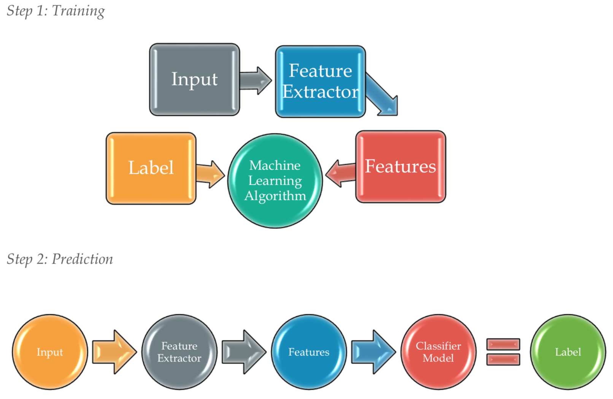
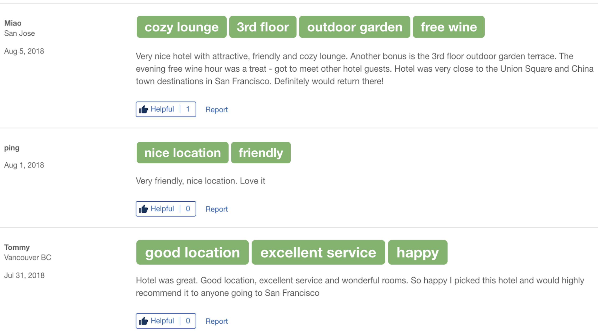
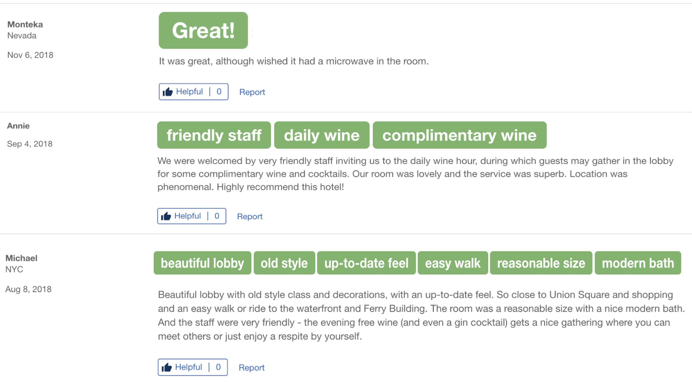
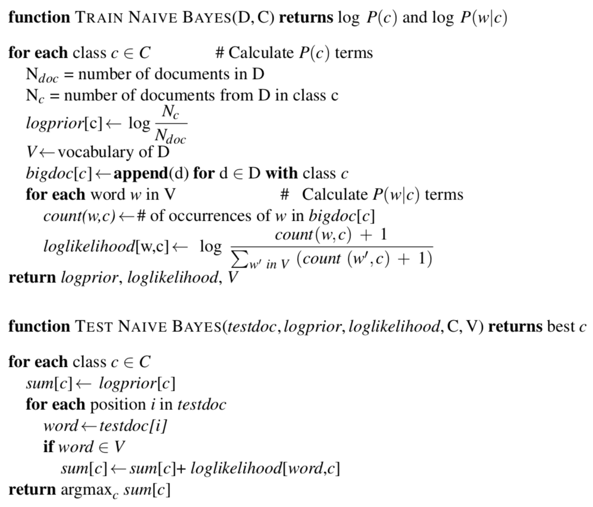
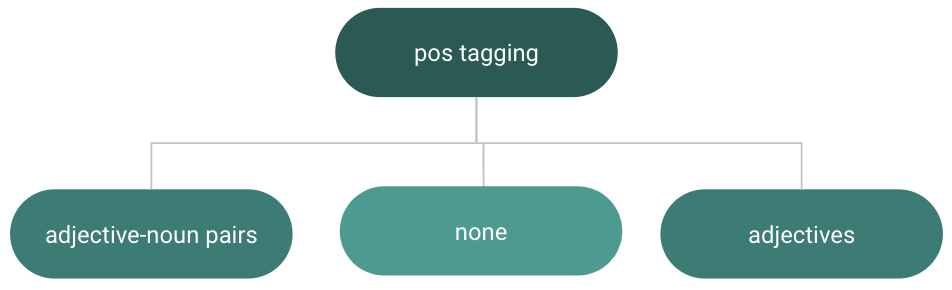

# Naive-Bayes-Classifier-for-Sentiment-Analysis
Implementation of the Naive Bayes algorithm to perform sentiment analysis on hotel reviews. The goal of this project is to train the Naive Bayes Classifier and use it as a model to predict the labels of new hotel reviews from the test set.

## Background
Travel is one of the fastest growing sectors and travel management companies are trying to provide best search experience to their users. The goal of this project is to decrease time spent on booking by providing customers relevant search results and categorize them in positive first fashion.  

**Criteria when choosing a hotel:**   
* Price
* Location/proximity
* Stayed before
* Local experience 
* Convenience 
* Affordability 
* Referrals 
* Special offers  

Everything starting from local experience down the list can be found in hotel reviews. With the advent of natural language processing, it is possible to classify reviews into positive and negative and suggest them in the search results as a criterion along with price and proximity. Sentiment analysis is used for text categorization task to split reviews into two based on the positive and negative orientation each reviewer expresses toward their experience.  
Most of the classification tasks in language processing are accomplished with supervised machine learning. In supervised learning, the training data consists of a set of input that has target data. Target data is the answer the algorithm should produce. This is usually denoted as a set of data (xi , ti ), where xi are inputs that have corresponding targets ti.

Supervised Classification Steps:

  

To be more descriptive with reviews in search results, we use part-of-speech tagging and retrieve adjective-noun pairs that describe reviewers’ experiences. These pairs can be used as a UI/UX feature and placed above each review saving readers’ time. If labels are describing something a user is not interested in, they can skip over and look at the next hotel in the search results without reading the entire review. The following figure shows a prototype of labels.

  
    

  

## Data

For this experiment, we use data from [Kaggle](https://www.kaggle.com/). There are 772,990 reviews in total that contain more than 2 words each. We use 557,220 reviews that contain more than 7 words each, 80% of which is training data and 20% is test data. The average number of words in each review from the training set is 29. Reviews did not contain any punctuation. Because we need to handle negation and decrement the number of duplicate words at a sentence level, we insert full stop before each capitalized word. After verifying the validity of our classifier, we get 32,671 of other unlabeled reviews from Kaggle for testing.

## Optimizing for Sentiment Analysis 

It is common practice to remove stop words from train and test sets because they do not make any difference when analyzing for sentiment. Removing stop words from data improves performance. We identified top 120 most frequent words through getting 200 most frequent words first. These 200 words contain words like beautiful, wonderful, comfortable, great, staff, breakfast. We removed them from our list because they impact sentiment and can be useful for adjective-noun pairs (e.g. delicious breakfast, amiable staff).

### Binary Multinomial Naive Bayes

For sentiment analysis, the occurrence of a word is more important than its frequency. Removing one copy of a word when processing a sentence if it occurs more than once improves performance. This type of classifier is known as Binary Multinomial Naive Bayes. When tokenizing our documents into sentences, we decrement the number of duplicate words in each sentence. Example: Our room was excellent, staff were excellent, and the service was superb. vs. Our room was excellent, staff were, and the service superb.

Another technique we use for optimization is dealing with negation. Consider the following sentences:
1. My stay was really bad and staff was unfriendly.
2. My stay was not bad this time and staff was not unfriendly.
3. The hotel was bad and I did not like breakfast because it was overcooked.
We prepend not to each word after encountering a token of logical negation (n’t, not, no) until the next punctuation mark or conjunctions as and, but, because. Example: Although the room was large, it was not really worth the money. vs. Although the room was large, it was not NOT_really NOT_worth NOT_the NOT_money.

Following is the Naive Bayes Algorithm:

  

## Part-of-Speech Tagging

After classifying unlabeled reviews into positive and negative, we use part-of-speech tagging on positive reviews. We classify 'unseen' reviews to order them by their orientation with positive reviews coming first having labels above them.

After tagging positive reviews, we create bigrams to retrieve adjective-noun pairs and store them in a list. We can have multiple scenarios:
1. There might be no adjective-noun pairs.
2. There might be very few adjective-noun pairs. Therefore, we also store adjectives from a review that do not occur in adjective-noun pairs. In case both lists are empty, we have one label saying ’good’ above the review if it is positive.

  

## Acknowledgements
* Jessen Havill, Professor of Computer Science and Benjamin Barney Chair Director at Denison University

## References
* Ralf Herbrich, Thore Graepel. Machine Learning: An Algorithmic Perspective. Second Edition, CRC Press, 2015.
* [Dan Jurafsky and James H. Martin. Speech and Language Processing. Third Edition Draft, 2018.](https://web.stanford.edu/jurafsky/slp3/)
* [515K Hotel Reviews Data in Europe from Kaggle.](https://www.kaggle.com/jiashenliu/515k-hotel-reviews-data-in-europe)
* [Hotel Reviews from Kaggle.](https://www.kaggle.com/datafiniti/hotel-reviews)
